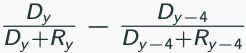
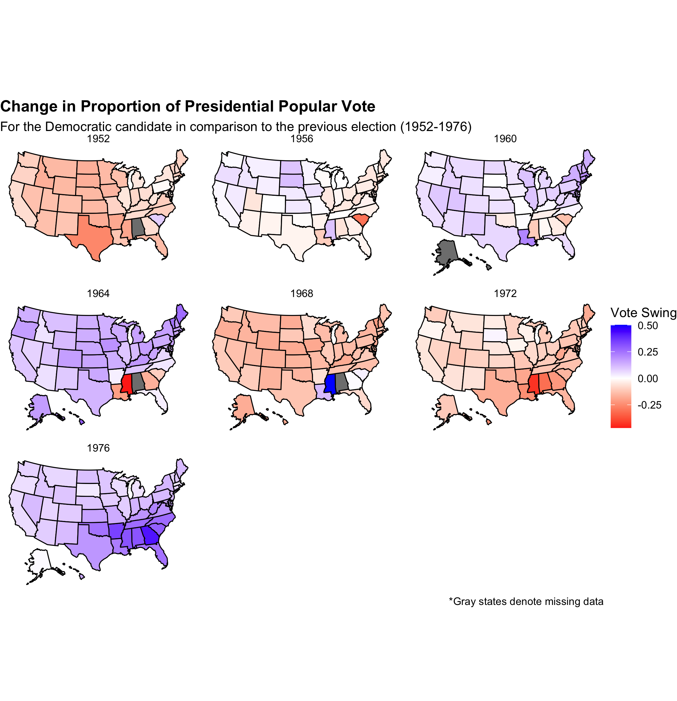

# Swing States
## September 13, 2020

A number of states are famous (or infamous) for swinging back and forth between the parties for the presidential election. Through the following graphics, I aim to depict the trends of battleground states. The first graphic shows the change in the proportion of the popular vote for the Democratic candidate in comparison to the previous election. Unsurprisingly, blue represents a shift to the Democratic candidate and red a shift to the Republican. The change in proportion was calculated using the formula below where D is the number of Democratic votes, R is the number of Republican votes, and y is the year. Therefore, it calculates the difference in the proportion of Democratic votes between the given election and the one preceding it.

The second graphic shows which states flipped in any given election year in comparison to the one before. My goal in making this addition graphic was to concretely display the effect of the sway in the vote. Did changes in the states actually lead to them flipping? Clearly they oftentimes did. The last two graphics are the exact same as the first two but depict 1980 to the present day. Having all the years on one graphic made the individual states too small to be easily readable.

 

The data set was sourced from the course's Canvas page. The code to replicate the above graphics can be found [here](https://github.com/SamuelLowry/gov1347_blog/blob/master/scripts/01-blog.R).
