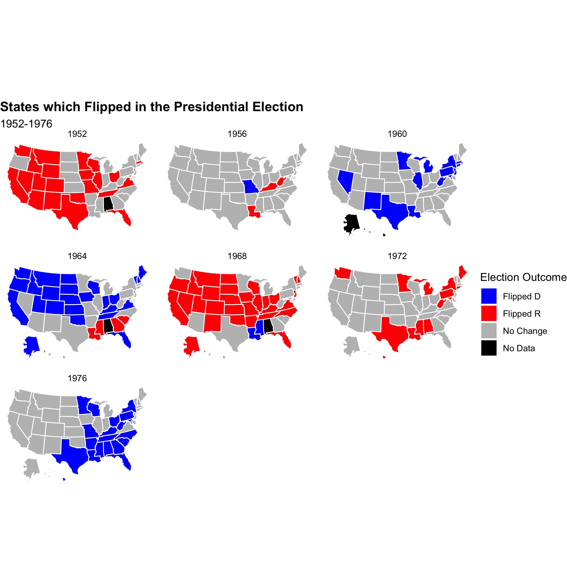
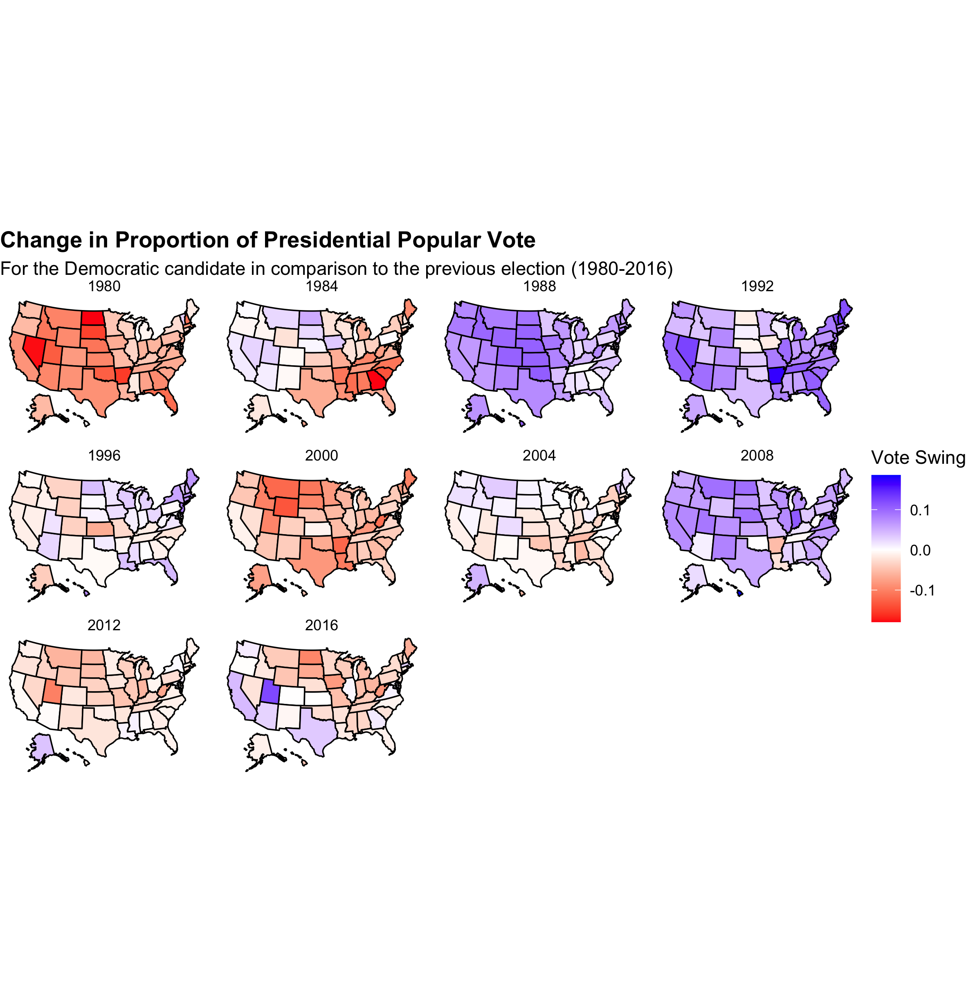

# Swing States
## September 13, 2020

A number of states are famous (or infamous) for swinging back and forth between the parties for the presidential election. Through the following graphics, I aim to depict the trends of battleground states and highlight a number of special cases. The first graphic shows the change in the proportion of the popular vote for the Democratic candidate in comparison to the previous election. Unsurprisingly, blue represents a shift to the Democratic candidate and red a shift to the Republican. The change in proportion was calculated using the formula below where D is the number of Democratic votes, R is the number of Republican votes, and y is the year. Therefore, it calculates the difference in the proportion of Democratic votes between the given election and the one preceding it.

The second graphic shows which states flipped in any given election year in comparison to the one before. My goal in making this addition graphic was to concretely display the effect of the sway in the vote. Did changes in the states actually lead to them flipping? Clearly they oftentimes did. The last two graphics are the exact same as the first two but depict 1980 to the present day. Having all the years on one graphic made the individual states too small to be easily readable.

One narrative that stands out in the graphic is just how much Mississippi flip-flopped. From 1964 to 1980 (shown in the last two graphics), Mississippi switched parties with its popular vote every single election. Its tumultuous 16 years can be explained by the fracturing of the Democratic party in the 1960s over segregation culminating in the creation of the Dixiecrats and the subsequent Republican pursuit of the (Southern Strategy)[https://www.theatlantic.com/ideas/archive/2019/08/emerging-republican-majority/595504/]. While Mississippi had been (voting)[https://en.wikipedia.org/wiki/United_States_presidential_elections_in_Mississippi] for Democrats or segregationist Dixiecrat alternatives, in 1964 Republican Barry Goldwater ran a conservative campaign emphasizing states rights which provided Mississippi a viable Republican alternative to LBJ. In 1968, Dixiecrat George Wallace ran on a segregationist platform granting him the vote. Then in 1972, Nixon, the Republican incumbent, having deployed the Southern Strategy, won the state back. With formal segregation now largely out of the picture, the elections of 1976 and 1980 were both very close but ultimately led to flips numbers 4 and 5. Mississippi was the ultimate swing state. Emphasis on was because from 1980 onward it has been a Republican stronghold. 

The sheer amount of color on the maps depicts the electrifying popularity of certain individuals which led to states frequently bobbling back and forth between the parties. In 1952, Ike took the cake from the Democratic dynasty of Roosevelt and Truman. In 1960, JFK took it back. In 1964, LBJ continued the trend but alienated Southern states over civil rights. In 1968, Nixon championed the socially conservative silent majority and flipped a majority of states. In 1972, he tightened his grip. Finally, in 1976, Carter offered an alternative to the legacy of Nixon's corruption. From Ike to Carter, there was (little distinction)[https://centerforpolitics.org/crystalball/articles/when-the-whole-map-was-in-play/] between solid and swing states.

The color of the change in proportion graphic tends to be predictive of states flipping, that is not always the case. Obviously the shift to the right led to Reagan's tenure and the blue map of 1992 led to Clinton's while the pendulum swung back in 2000 and finally the other way in 2008. Nevertheless, one exception is evident: 1988. The change in proportion map is overwhelmingly blue even though only a handful of states flipped. Bush still won. Reagan was a tough act to follow leading to the Democratic challenger gaining five percent of the popular vote compared to the 1984 election.

As a Michigander, it is funny for me to hear Michigan referred to as a swing state. Sure, Trump capitalized on Rust Belt dissatisfaction which flipped the state in 2016, but before that Michigan had been blue since Clinton's first term. Going further back, Michigan had only flipped in 1960 for JFK and 1972 for Nixon in our time frame. Since 1948, three states have flipped nine times: Florida, Louisiana, and Ohio. Another six have flipped seven times. Nevertheless, that is not to say Michigan is not currently a swing state. The graphics suggest a trend away from the back and forth that was the 1950s through the 1970s. States are largely solid blue or solid red now. Trump won due to swinging six key states. It was not as if he was 1968 Nixon. At the same time, between Ike and Reagan, the civil rights movement and desegregation occurred. Vietnam happened and so did Watergate. The parties were in shambles and largely rearranged themselves. It was a chaotic time—not all too dissimilar from those we live in now. Perhaps we shall return to a time when the whole map will be in play again.

 

The data set was sourced from the course's Canvas page. The code to replicate the above graphics can be found [here](https://github.com/SamuelLowry/gov1347_blog/blob/master/scripts/01-blog.R).
