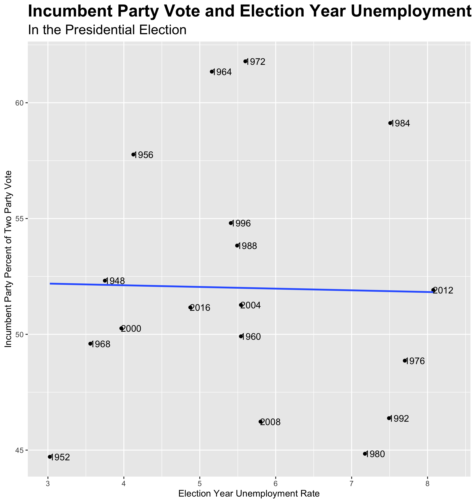

# Unemployment as a Predictor
## September 20, 2020

I must preface this blog by saying that using the election year unemployment rate alone is a thoroughly terrible way to predict the upcoming presidential election. My work proves such.

 

Following the third prompt, I set out to build a predictive model for 2020 by using unemployment data at the state level. Of course, I first had to create a simple national model as a point of comparison. Through some data wrangling, I was able to create a data frame which included a column for year, unemployment rate as a percent, and the incumbent party candidate's percent of the two party vote. I plotted the points below and added the years to the points in order to display the elections. I also added a linear model trend line. As you can see, the points are more so a cloud than anything else. The R-squared is laughably low at 0.00045. Merely for readability, I added limits to the x-axis to bump the maximum slightly higher than 8 percent so that "2012" would show up.

Using the predict function, I predicted the 2020 election outcome on this already unreliable model. Using data unemployment which encompasses all of 2020, the model predicts that Trump will receive 51.8 percent of the two party vote. COVID-19 is obviously a huge game changer, so I also predicted the vote based only upon unemployment numbers from the height of the pandemic. Due to the barely negative slope, this only led do a decrease in 0.3 percent.

The whole point of this exercise was to look look at the states. Therefore, the two maps below show predictions for the 2020 election based upon models for each state. After realizing that interaction terms would not yield a model for each state independently, I used a series of map functions. I then plucked out the intercepts (incumbent party candidate's percent of the two party vote if the unemployment rate was theoretically zero) and coefficients (the change in the incumbent party candidate's percent of the two party vote associated with the unemployment rate increasing by one) which I used to make the predictions. The The tiny R-squared trend continued at the state level. In addition, the data was even more limited. I only had 1976-2016 to work with instead of 1948 and onward. As was to be expected, this led to a worse model overall. The small samples led to some wonky trends. In many states, an increase in the unemployment rate was associated with the incumbent party receiving a higher percentage of the two party vote. The model also takes no other points into consideration such as general party preferences. Therefore, California and Washington state are red.

Just like with the national vote, I wanted to take COVID-19 into account. Therefore, again, I made a prediction using just unemployment data from the height of the pandemic. This turned many battleground states blue, but I sum this up to mere coincidence. Unemployment, especially at the n-value levels we are working with, is not a reliable predictor on its own. Predicting the 2020 election requires much more sophisticated models which I look forward to learning more about. 

 

The data set was sourced from the course's Canvas page. The code to replicate the above graphics can be found [here](https://github.com/SamuelLowry/gov1347_blog/blob/master/scripts/02-blog.R).