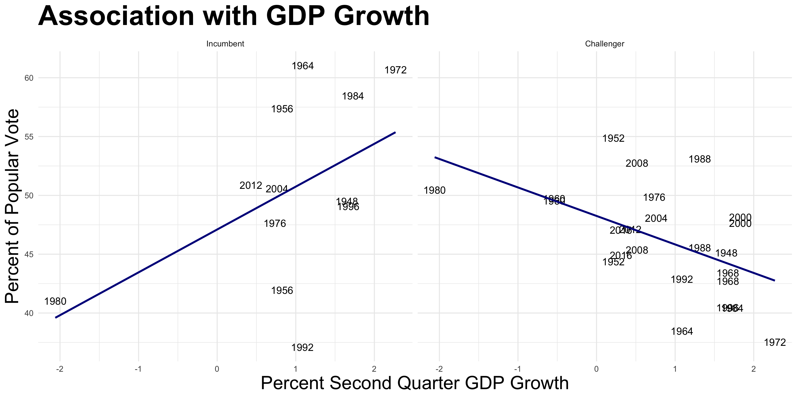
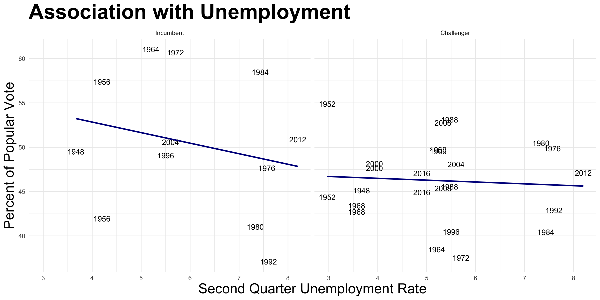
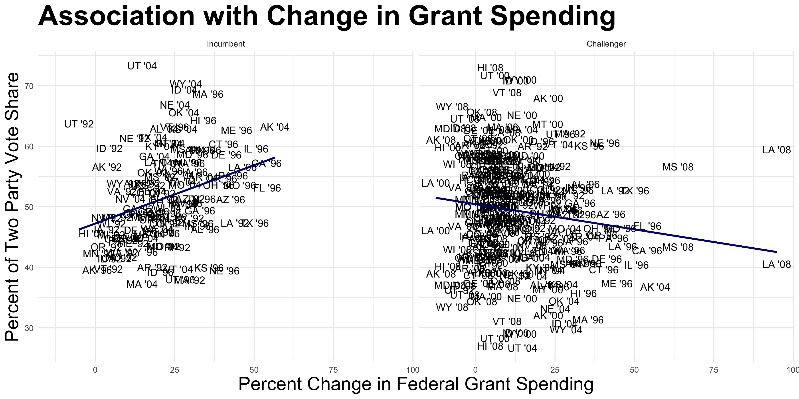
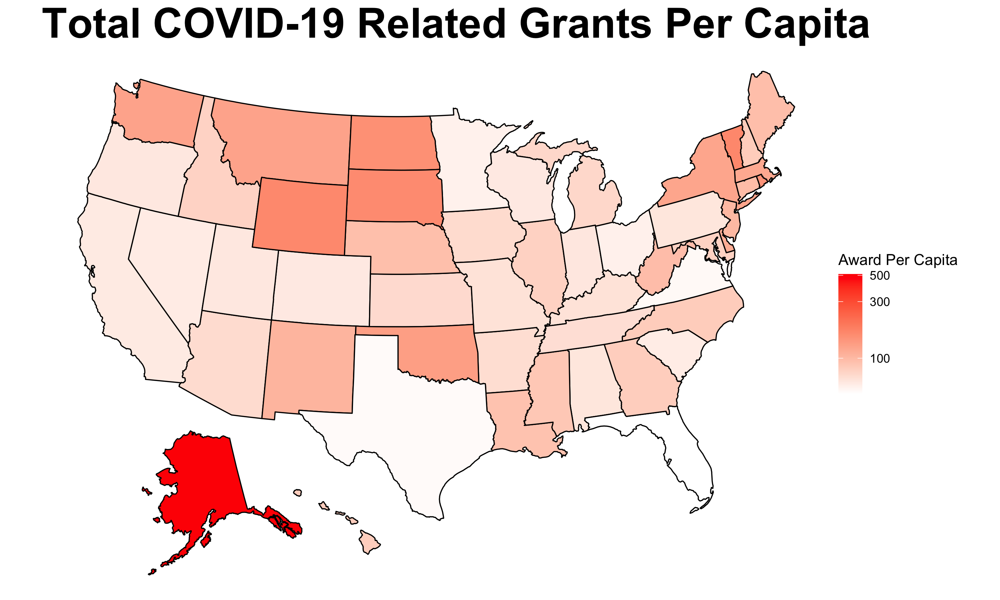

# Incumbency
## October 4, 2020

This week I set out to discover if Trump being the incumbent will help of hinder his chances of reelection. Unlike past weeks investigated the variation in pollster quality. Then, using FiveThirtyEight's grading system, I created a model predicting the 2020 presidential election which also included a component based upon GDP growth. A key takeaway from this week was that **COVID-19 has made reliance on fundamental economic factors unreliable.**

 

It is clear that 2020's polls are not doing as well in school as 2016's. That is not necessarily a bad thing, though, keeping in mind Trump's unforeseen victory in 2016. Nevertheless, we can't just blame 2016 for 2020's mediocre grades. FiveThirtyEight, the teacher in this metaphorical school, notes that, ["it hasn’t been a great year for pollsters. The 2020 presidential primary polls had a weighted average. . . of 10.2 percentage points. That’s roughly tied with the 2016 presidential primaries for the biggest error in primary polling this century."](https://fivethirtyeight.com/features/weve-updated-our-pollster-ratings-ahead-of-the-2020-general-election/). The polls could be as unreliable as 2016—just now the grades reflect this. With such a possibility, poll grades should play a significant role within predictive models. Therefore, in my model presented later on, I weighted all the A polls to have three times the influence as the C polls and weighted the B polls to have twice the amount of influence. I completely cut out the D and F polls. 

 

Aside from poll grades, poll timing also plays a significant role. As noted by [Jennings et al. (2020)](https://www-sciencedirect-com.ezp-prod1.hul.harvard.edu/science/article/pii/S0169207019302572), polls become more predictive the closer to the election they take place. Here, on the left, are all of the polls for the general election since November 2019. We see a divergence with Biden gaining (obviously influenced by him becoming the Democratic nominee) and Trump losing ground (in part due to the COVID-19). On the right, though, polls have more or less settled and are largely consistent on average during the month of September. Keeping this in mind, I did not use any polls prior to September 2020 in my model in line with the findings of [Jennings et al. (2020).](https://www-sciencedirect-com.ezp-prod1.hul.harvard.edu/science/article/pii/S0169207019302572) 
 

 

At the same time, fundamentals are called that for a reason and are heavily relied upon in many forecasts including [The Economist's](https://projects.economist.com/us-2020-forecast/president/how-this-works). Therefore, I used second-quarter GDP growth to predict the popular vote. I confined myself to the second-quarter due to not yet having any more recent data from 2020. Therefore, I kept it consistent across all years. As seen here, the trend diverges drastically between the incumbent and the challenger. If the economy is doing poorly, as it is now, you'd rather be the challenger. Nevertheless, as noted by [Brown (2014)](https://www-cambridge-org.ezp-prod1.hul.harvard.edu/core/services/aop-cambridge-core/content/view/ECFE39E003912F8AF65C2AD14A34BD8C/S2052263014000062a.pdf/div-class-title-voters-don-t-care-much-about-incumbency-div.pdf), **voters don't care much about incumbency**. Instead, compounding variables such as "pork barrel" spending are at play. Therefore, following the guidelines of fundamentals-skeptic [Nate Silver](https://fivethirtyeight.com/features/how-fivethirtyeights-2020-presidential-forecast-works-and-whats-different-because-of-covid-19/), I relied heavily on polls. In line with his work for FiveThirtyEight and [its weighting](https://fivethirtyeight.com/features/how-fivethirtyeights-2020-presidential-forecast-works-and-whats-different-because-of-covid-19/) this close to the election, I gave the poll model 87 percent of the say and the fundamentals model 13 percent of the say for my ensemble prediction. 

 

All of the above work led to the below predictions at 95 percent confidence intervals. Most notably, the fundamentals predictions are far from reality. For example, Trump's lower bound is -34.85! This is due to profound extrapolation. The most negative second-quarter GDP growth before 2020 was in 1980 at around negative two percent. Due to COVID-19, 2020's was around negative nine percent! This year is such an outlier that it cannot reliably be predicted using historical data. Now, more than ever, we ought to rely on polls. The poll predictions temper the, in this case, unreliable fundamentals. Especially with Trump, the fundamentals widen the confidence interval significantly. Statistics aside yet statistically informed, I am much more *confident* in polls due to COVID-19. Keeping 2016 in mind, they are not perfect, but right now they are the best we have.

 

*The data set was sourced from the course's Canvas page with the exception of the state population data which can be found [here](#https://worldpopulationreview.com/states)  for 2020 and [here](#https://www.kaggle.com/hassenmorad/historical-state-populations-19002017) for prior to this year as well as for the COVID-19 grants which can be found [here](taggs.hhs.gov/coronavirus). The code to replicate the above graphics can be found [here](https://github.com/SamuelLowry/gov1347_blog/blob/master/scripts/04-blog.R).*