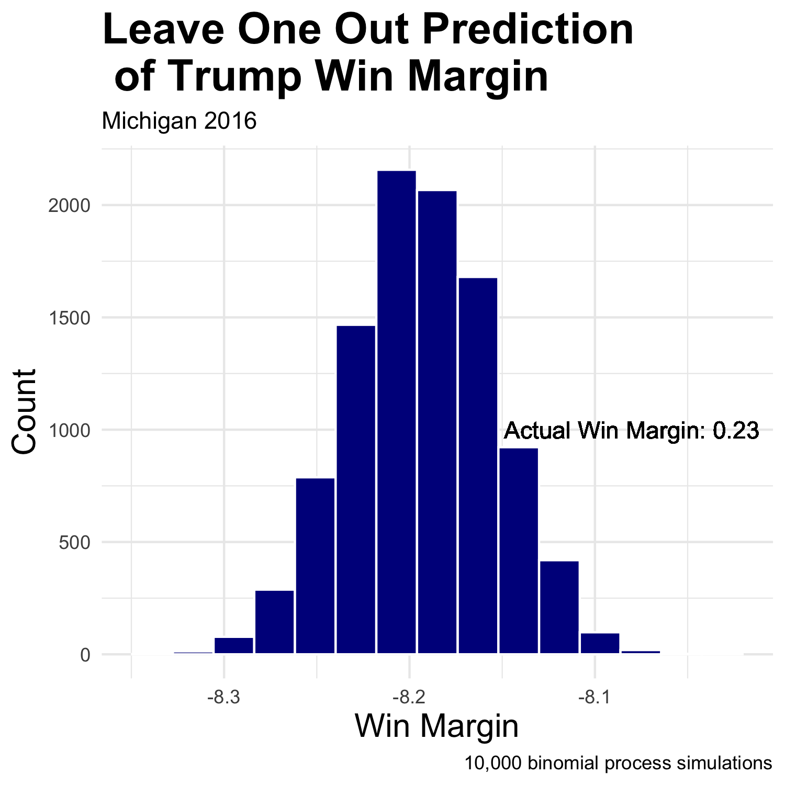
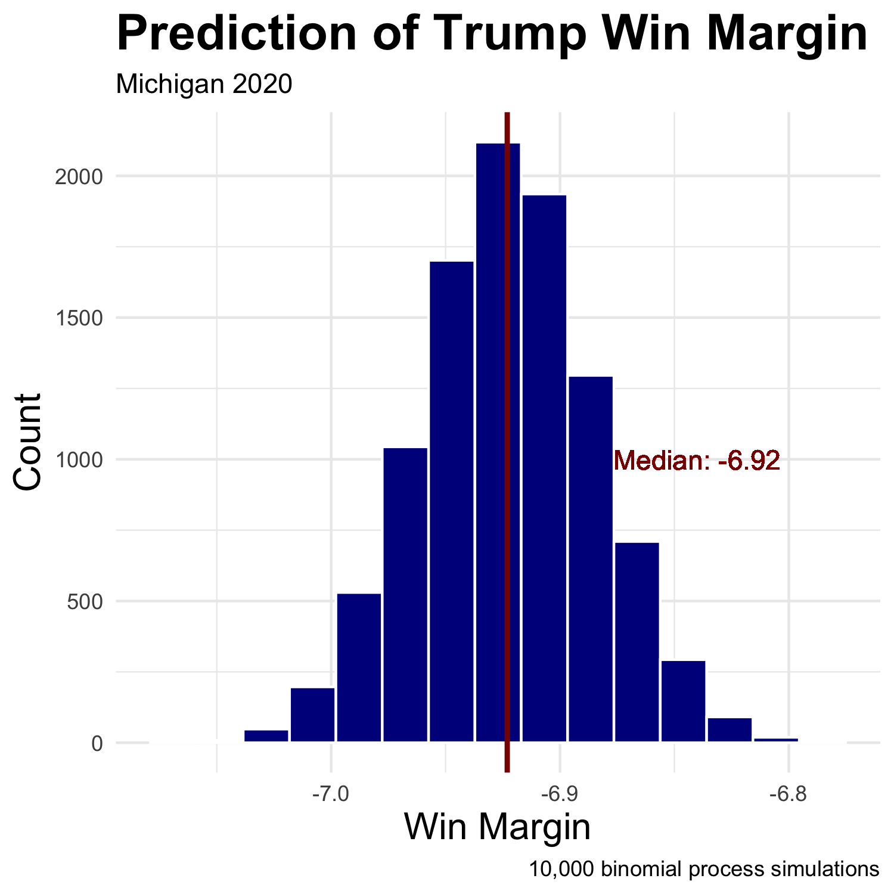
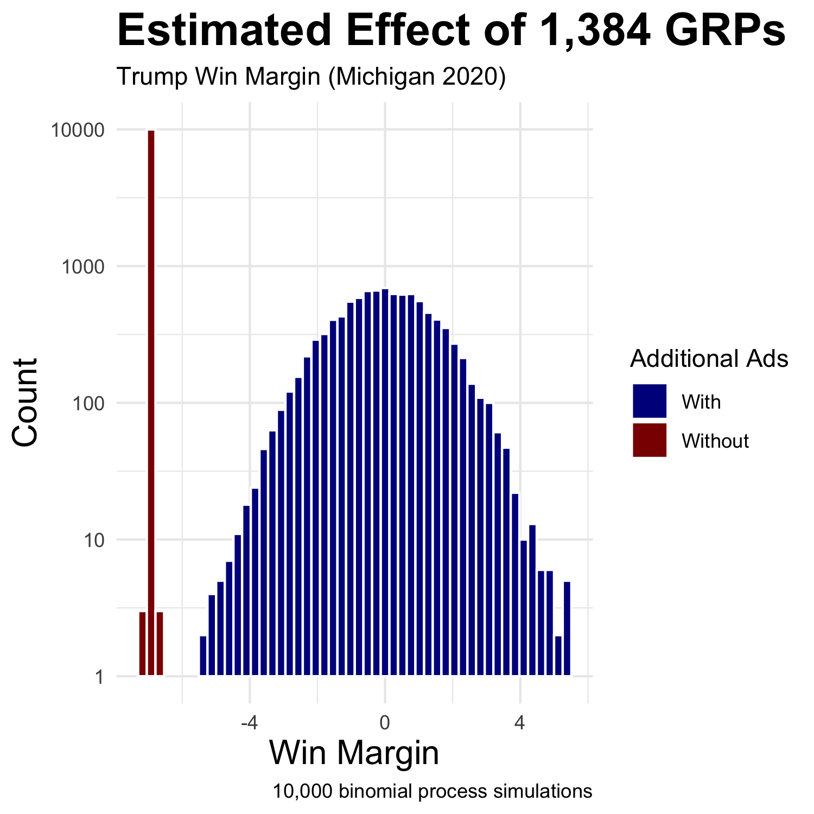

# The Air War
## October 11, 2020

This week I set out to discover if Trump being the incumbent helps or hinders his chances of reelection. Unlike past weeks, my goal is to make an informed judgment call as to the sign of the effect and not necessarily to make a robust, thoroughly tested model predicting the 2020 presidential election. First, I looked at the interaction between economic fundamentals and incumbency status. Secondly, I sought to take into account the influence of the president's dispensation of federal grants.

 

When discussing the effect of incumbency on elections, we must keep in mind two contrasting but not mutually exclusive points from the literature. [Brown (2014)'s](https://www-cambridge-org.ezp-prod1.hul.harvard.edu/core/services/aop-cambridge-core/content/view/ECFE39E003912F8AF65C2AD14A34BD8C/S2052263014000062a.pdf/div-class-title-voters-don-t-care-much-about-incumbency-div.pdf) title states it plainly: *Voters Don't Care Much About Incumbency*. When presented with vignettes of candidates, whether the candidate was an incumbent or not did not seem to play into who respondents chose to vote for. On the other hand,  [Campbell (2016)](https://hollis.harvard.edu/primo-explore/fulldisplay?docid=TN_cdi_gale_infotracacademiconefile_A473675815&context=PC&vid=HVD2&lang=en_US&search_scope=everything&adaptor=primo_central_multiple_fe&tab=everything&query=any,contains,Campbell%20(2016)%20“Forecasting%20the%202016%20American%20National%20%20Elections”) is quick to point out that presidents tend to win a second term. Since WWII, only Gerald Ford, Jimmy Carter, and George H.W. Bush did not win their reelection bids. Obviously, the president has special privileges the challenger does not. He gets mass media coverage unrelated to the campaign. He holds sway over federal finances. Instead of campaign promises, he has a track record—exemplified by Reagan asking, "Are you better off than you were four years ago?" While [Brown (2014)](https://www-cambridge-org.ezp-prod1.hul.harvard.edu/core/services/aop-cambridge-core/content/view/ECFE39E003912F8AF65C2AD14A34BD8C/S2052263014000062a.pdf/div-class-title-voters-don-t-care-much-about-incumbency-div.pdf) is correct in saying that incumbency does not matter if it is a binary variable presented to respondents, in the real world it matters a great deal leading to a defined incumbency advantage.

 

But this is not always the case. Gerald Ford, Jimmy Carter, and George H.W. Bush still lost. As noted many times before, the economy plays a huge role in election outcomes. And while Reagan was able to ask that question, the threat of the converse and subsequent blame attribution looms large. Taking the economy into account, I used second-quarter GDP growth to predict the popular vote. I confined myself to the second-quarter due to not yet having any more recent data from 2020. Therefore, I kept it consistent across all years. As seen here, the trend diverges drastically between the incumbent and the challenger. If the economy is doing poorly, as it is now, you'd rather be the challenger. In recession, the incumbency advantage can dissipate.  

 

The incumbency advantage is harder to tease out when looking at unemployment. The incumbent model has a much more negative slope but also a much higher intercept. Therefore, when unemployment is low, it is associated with incumbent victory. Nevertheless, if unemployment is drastically high, as it is now, the data suggest a challenger victory. Again, in recession, the incumbency advantage can dissipate.  

 

 

At the same time, 2020 is a complete wild card year due to COVID-19. It is difficult to predict the election using historical data due to 2020's economic data being outliers. Post WWII, during an election year, the most negative second-quarter GDP growth was in 1980 at around negative two percent. It was negative nine percent this year. As to unemployment, it was around eight percent in 2012 while it was around 13 percent this year. Therefore, due to such profound extrapolation, the confidence intervals of the above predictions are quite large. Alas, I show the estimates not presuming they are spot on the future popular vote tallies but to inform our judgment of the effect incumbency has on Trump's reelection chances.

To return to the confounding variables leading to the incumbency advantage, [Kriner and Reeves (2015)](https://www.cambridge.org/core/journals/american-political-science-review/article/presidential-particularism-and-dividethedollar-politics/962ABE4FC41A6FF3E1F95CE1B54D1ADD) observes that, ["presidents systematically prioritize the needs of politically important constituents."](https://www.cambridge.org/core/journals/american-political-science-review/article/presidential-particularism-and-dividethedollar-politics/962ABE4FC41A6FF3E1F95CE1B54D1ADD) Presidents utilize federal funds in key areas in hopes of currying the favor of voters. In order to determine if this practice actually affects popular vote, I calculated the average percent change in federal grants per state in comparison to the previous presidential term. The data suggest that the more you spend, the higher the two party vote share you receive within that respective state. Therefore, Trump, by giving federal grants to swing states, could influence the election.

 

Is Trump using COVID-19 as an opportunity to shove relief funds into swing states in order to win the election? It appears not. States which carried Trump to victory in 2016 have seen little aid. In fact, Florida has received the least at around 50 dollars per capita. Wisconsin, Michigan, and Pennsylvania are not doing too much better. Not only is Trump divvying out the aid in a manner that leaves [people scratching their heads](https://apnews.com/article/48b8109fce0d922a8fb0f5fce20dee92), it is not even strategically advantageous. This could be a factor in the [recent polls](https://www.usatoday.com/story/news/politics/elections/2020/10/03/poll-trump-trials-biden-florida-pennsylvania/3611058001/) that find that Biden is leading in Florida and Pennsylvania. An aside as to the scaling choices, Alaska is such an outlier at around 500 dollars in aid per capita that I had to use a log scale in order to display contrast within the continental United States.

 

All in all, even though the incumbency advantage has historically played a role, I do not believe it will apply to Trump. The economy being in decline does not bode well for the incumbent. In addition, what influence Trump does have over COVID-19 aid is not being utilized to benefit his reelection chances. And with nearly [60 percent](https://projects.fivethirtyeight.com/coronavirus-polls/) of Americans disapproving of his handling of the pandemic, his odds do not look good. If Trump were to invoke Reagan and ask if we are better off now than we were four years ago, many Americans would say no and attribute it to Trump. While not all the blame can rest on Trump's shoulders directly, it still stands that him being the incumbent seems to hinder his chances of reelection in this very unpredictable year we call 2020. 

 

*The datasets was sourced from the course's Canvas page. The code to replicate the above graphics can be found [here](https://github.com/SamuelLowry/gov1347_blog/blob/master/scripts/04-blog.R).*