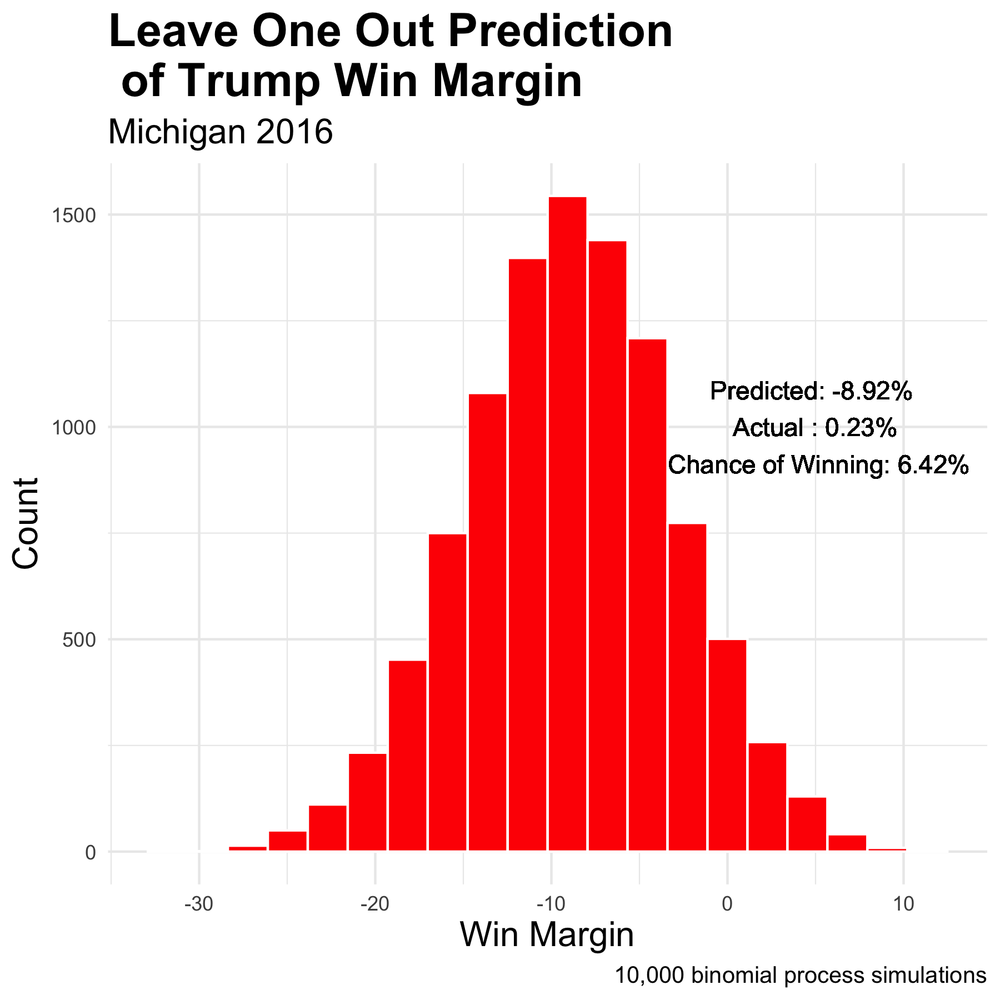

# The Ground Game
## October 18, 2020

Continuing my trend of being a tried and true Michigander, this week I updated my probabilistic simulation of the race in Michigan. 

Instead of the probability of the binomial distribution  the binomial logistic regression by adding variance to the estimate of the 
As a Michigander, it is funny for me to hear Michigan being referred to as a swing state. Sure, Trump capitalized on Rust Belt dissatisfaction which flipped the state in 2016, but before that Michigan had been blue since Clinton's first term. Was 2016 a blip in an otherwise blue trend? If so, what extra does the Trump campaign have to do to retain the state? In order to get at the answers to these questions, I first made a probabilistic simulation of the race in Michigan based upon binomial logistic regression. I then assessed the model using leave-one-out cross-validation. After that, using [Gerber et al. (2011)](https://www-cambridge-org.ezp-prod1.hul.harvard.edu/core/journals/american-political-science-review/article/how-large-and-longlasting-are-the-persuasive-effects-of-televised-campaign-ads-results-from-a-randomized-field-experiment/DA29FE8A5581C772006A1DEBB21CFC4C/core-reader), I estimated how much the Trump campaign would have to outspend the Biden campaign a week before the election on ads in order to make the election a toss-up.

 

Polls, in recent history, have a rocky track record in Michigan due to the 2016 election. Therefore, in order to assess the binomial logistic regression which uses historical poll averages and actual vote share to make predictions of future win margin using current poll averages, I performed leave-one-out cross-validation. In this case, I removed the 2016 data from the model and predicted the 2016 election using [FiveThirtyEight's poll averages from 2016](https://projects.fivethirtyeight.com/2016-election-forecast/michigan/). I used the poll averages from October 11, 2016 to be consistent with the later on 2020 prediction using poll average data from the same date four years later. The leave-one-out model predicted that Trump would lose by about 8.2 percent in 2016—consistent with predictions at the time. In actuality, Trump won by 0.23 percent. [While pollsters are working hard to correct the mistakes seen in 2016](https://www.technologyreview.com/2020/02/14/844770/pollsters-got-it-wrong-in-the-2016-election-now-they-want-another-shot/), **the below prediction for 2020 must also be taken with a grain of salt**. Nevertheless, as noted in a [previous blog](https://samuellowry.github.io/gov1347_blog/posts/03-blog.html), polling data is currently our best predictor due to COVID-19 making the economy an unreliable predictor. 

 

Using historical data, now including 2016 data, I performed the same process to predict Trump's 2020 win margin. Based upon 10,00 binomial process simulations, Trump is estimated to lose Michigan by 6.92 percent in November. To further explain the process used to attain this figure, I first created the two models, one for each party, using binomial logistic regression predicting the probability of voting for the given party by using [current poll averages from FiveThirtyEight]( https://projects.fivethirtyeight.com/polls/president-general/michigan/). Then, I created two distributions, one for each party, by repeatedly drawing voters from the voting eligible population based upon the predictions using the aforementioned models. By taking the difference of the two distributions, I was able to estimate Trump's win margin. Again, due to the leave-one-out cross-validation, this prediction should be taken with a grain of salt.

 

The polls indicate that Trump is well behind Biden. How, therefore, could Trump catch up? While [Huber et al. (2007)](https://onlinelibrary.wiley.com/doi/abs/10.1111/j.1540-5907.2007.00291.x) finds, "little evidence that citizens are mobilized by or learn from presidential advertisements," [Gerber et al. (2011)](https://www-cambridge-org.ezp-prod1.hul.harvard.edu/core/journals/american-political-science-review/article/how-large-and-longlasting-are-the-persuasive-effects-of-televised-campaign-ads-results-from-a-randomized-field-experiment/DA29FE8A5581C772006A1DEBB21CFC4C/core-reader) estimates that 1,000 gross rating points (GRPs, the percent of reachable audience multiplied by the number of airings) can buy a five percent shift in the vote with a standard error of 1.5. Using [Gerber et al. (2011)'s](https://www-cambridge-org.ezp-prod1.hul.harvard.edu/core/journals/american-political-science-review/article/how-large-and-longlasting-are-the-persuasive-effects-of-televised-campaign-ads-results-from-a-randomized-field-experiment/DA29FE8A5581C772006A1DEBB21CFC4C/core-reader) numbers, I adjusted Trump's win margin assuming that his campaign had 1,384 GRPs more than Biden's a week before the election which would shift his win margin from -6.92 percent to 0 percent—making the election a toss-up. Due to the drastically different distributions, I scaled the y-axis logarithmically.

Assuming 1 GRP roughly cost the same amount in Michigan as it does in Pennsylvania at 300 dollars, 1,384 GRPs would cost about 415,200 dollars. Compared to how much the campaigns spend, this seems like a worthwhile investment in order to become competitive in Michigan in the final week. Nevertheless, the Trump campaign is being routinely out-spent and out-aired in Michigan. Trump is already behind, and as noted by [Huber et al. (2007)](https://onlinelibrary.wiley.com/doi/abs/10.1111/j.1540-5907.2007.00291.x), the final push only matters if there is a preexisting plethora of ads. **The odds do not look good for Trump come November, and his campaign strategy is not helping either.**

 

*The datasets were sourced from the course's Canvas page with the exception of the Michigan county based data which can he found [here](https://public.opendatasoft.com/explore/dataset/usa-2016-presidential-election-by-county/table/?disjunctive.state&sort=-african_american_population). The code to replicate the above graphics can be found [here](https://github.com/SamuelLowry/gov1347_blog/blob/master/scripts/04-blog.R).*