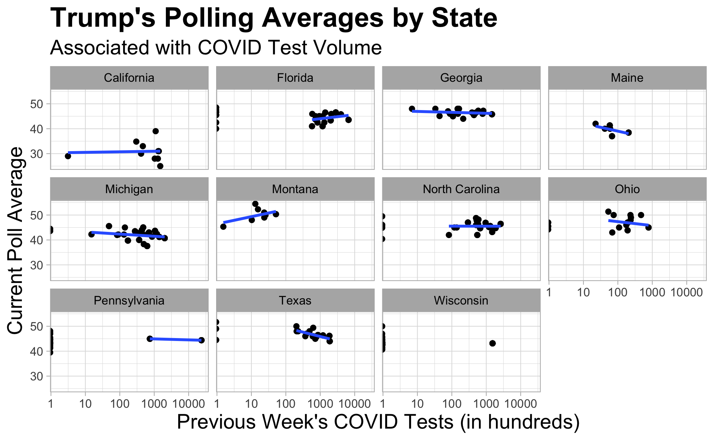

# The Effect of COVID
## October 25, 2020

Continuing my trend of being a tried and true Michigander, this week I updated my probabilistic simulation of the race in Michigan. Next, I used those numbers along with historic field office location and county two party vote share data to make recommendations to both the Trump and Biden Campaigns in regard to their ground game.

 

Instead of the probability of the binomial distribution of voters being based solely upon the median prediction, I utilized a normal distribution created by using the median prediction and the standard deviation of all polls preceding the given date. This produced a more realistic distribution and takes into account the differences between polls. I again performed leave-one-out cross-validation in order to assess the validity of the model. I removed the 2016 data from the model and predicted the 2016 election using [FiveThirtyEight's poll averages from 2016](https://projects.fivethirtyeight.com/2016-election-forecast/michigan/). I used the poll averages from October 18, 2016, as to simulate a prediction from four years ago today. The leave-one-out model predicted that Trump would lose by about nine percent in 2016—consistent with predictions at the time. In actuality, Trump won by 0.23 percent.

 

It is no surprise that a leave-one-out cross-validation of 2016 is far from the actual value. Nevertheless, this distribution actually gave Trump about a six percent chance of winning—[last week's](https://samuellowry.github.io/gov1347_blog/posts/05-blog.html) didn't give him a chance at all. The inclusion of poll standard deviation improved the predictive power of the model substantially. 

 

Switching gears, I imagined that I worked for the Trump or Biden campaign and that it was the night of March 4, 2020. Pete Buttigieg and Amy Klobuchar both dropped out and endorsed Biden leading to a [sweeping Super Tuesday victory](https://www.google.com/url?sa=t&rct=j&q=&esrc=s&source=web&cd=&cad=rja&uact=8&ved=2ahUKEwigsti3lsHsAhXLoHIEHZx3DlIQFjAAegQIAxAC&url=https%3A%2F%2Fwww.npr.org%2F2020%2F03%2F04%2F811868704%2F5-takeaways-from-super-tuesday-and-joe-bidens-big-night&usg=AOvVaw3wg04LmNus6l9Ot6PVWULj). Biden is now practically the presumptive nominee. The general election has begun. What ought I do ground-game-wise to win Michigan?

 

Well, first I have to figure out where the candidates stand. I am a fan of Nate Silver, so I rely on polls heavily. A binomial distribution will give me a general idea of point and variance, so I create the two models, one for each party, predicting the probability of voting for the given party by using [current poll averages from FiveThirtyEight]( https://projects.fivethirtyeight.com/polls/president-general/michigan/). Then, I make two distributions, one for each party, by repeatedly drawing voters from the voting eligible population based upon the predictions using the aforementioned models. The process also now utilizes a probability distribution based upon the standard deviation of poll estimates. By taking the difference of the two distributions, I can predict win margins. I adjust the y-axis using a square root scale in order to best see the distribution. Biden is up by just over three percent.

 

If I am working for Biden, I cannot let another 2016 happen. [She lost by a narrow margin of 13,000 votes](https://www.mlive.com/politics/2016/11/how_did_donald_trump_win_michi.html). She lost key counties outside of the Detroit stronghold, and Detroit voters didn't show up. To quote mlive, ["Compared to Barack Obama in 2008 and 2012, Clinton underperformed in counties such as Wayne and Genesee, which have Michigan's largest African-American communities. Those two counties alone gave Obama a net gain of 439,202 votes compared to 308,270 for Clinton in 2016."](https://www.mlive.com/politics/2016/11/how_did_donald_trump_win_michi.html) She could not get out the vote. [Clinton's ground game was therefore criticized in Michigan](https://www.politico.com/story/2016/12/michigan-hillary-clinton-trump-232547) and the Rust Belt in general. Nevertheless, she only had one less field office than Obama in 2012, and the locations were relatively the same. Despite what confounding variables there may be, Biden must double down in key areas and actually get out the vote. Some blue strongholds almost flipped in 2016 and only had one field office such as Marquette, Muskegon, Kalamazoo, and Lansing. Biden should double or triple the number of field offices in those higher population areas. Next, almost all other forces should be focused on southeastern Michigan—where the population is. Clinton lost by 13,000 but lost 130,000 votes in that area compared to Obama. Biden could need only 10 percent, but that ten percent will be crucial.

If I am working for Trump, I will of course recommend an office in every decently populated area, including the aforementioned ones, but also a few more in rural areas. West and north central Michigan were largely neglected, and it was those white working-class voters that carried him to victory in 2016. The margin is only 13,000. Trump will need another historic turnout in order to win. Unless rural areas head to the polls in droves, as they did in 2016, Trump will not win. Lastly, Trump has a wildcard Biden is not as adept at using—his rallies. [In the final week of the election, Trump held three rallies in Michigan](https://www.mlive.com/politics/2016/11/how_did_donald_trump_win_michi.html). These no doubt had an outsized impact on getting out the vote. Joe can't pack a stadium with the same enthusiasm as the Donald. Trump must use this to his advantage. Little do I know though that in three weeks, the country will be on lockdown due to COVID-19. 

 

All in all, while Clinton is accused of neglecting Michigan, her campaign had quite the presence in the state. Sure, she didn't have rallies quite like Trump, but her network of field offices was similar to Obama's. Clinton lost not because of her ground game but because she was Hillary Clinton. Going into the election, her favorability rating was around [42 percent](https://www.realclearpolitics.com/epolls/other/president/trumpbidenfavorability.html). In 2012, Obama's was around [50](https://elections.huffingtonpost.com/pollster/obama-favorable-rating). No matter how many contacts someone makes, if you don't like a candidate it is harder to will yourself to vote for them even if you agree with their policies. Looking ahead, Biden currently has a rating of [55](https://www.realclearpolitics.com/epolls/other/president/trumpbidenfavorability.html) if it is telling at all.

*The polling data were sourced from the course's Canvas page. The COVID data were sourced from [here](#https://covidtracking.com/about-data). The code to replicate the above graphics can be found [here](https://github.com/SamuelLowry/gov1347_blog/blob/master/scripts/04-blog.R).*