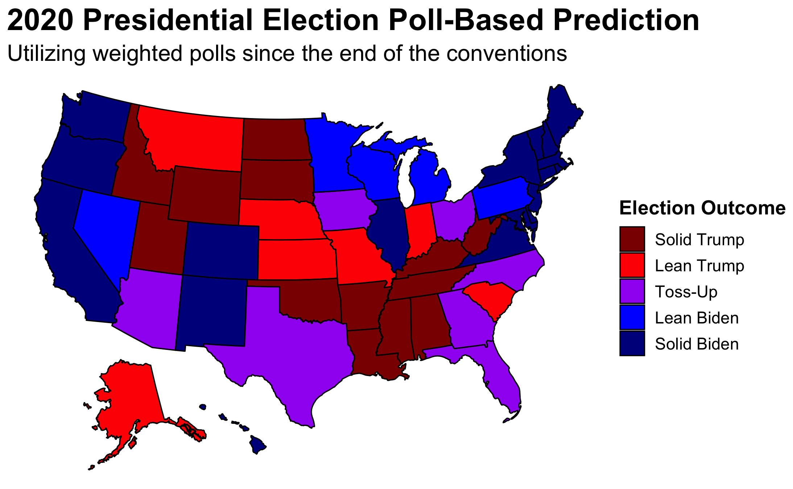
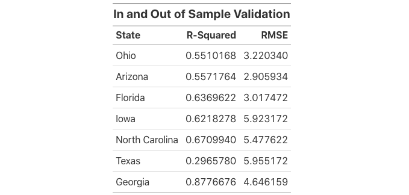
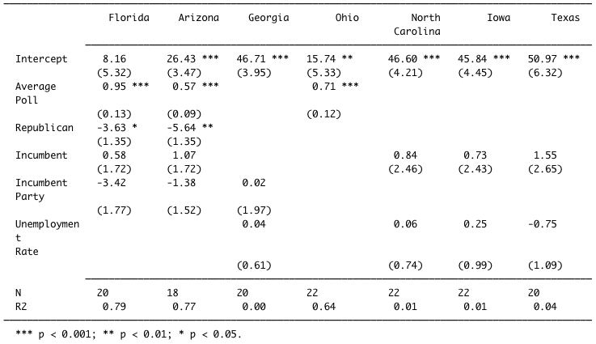
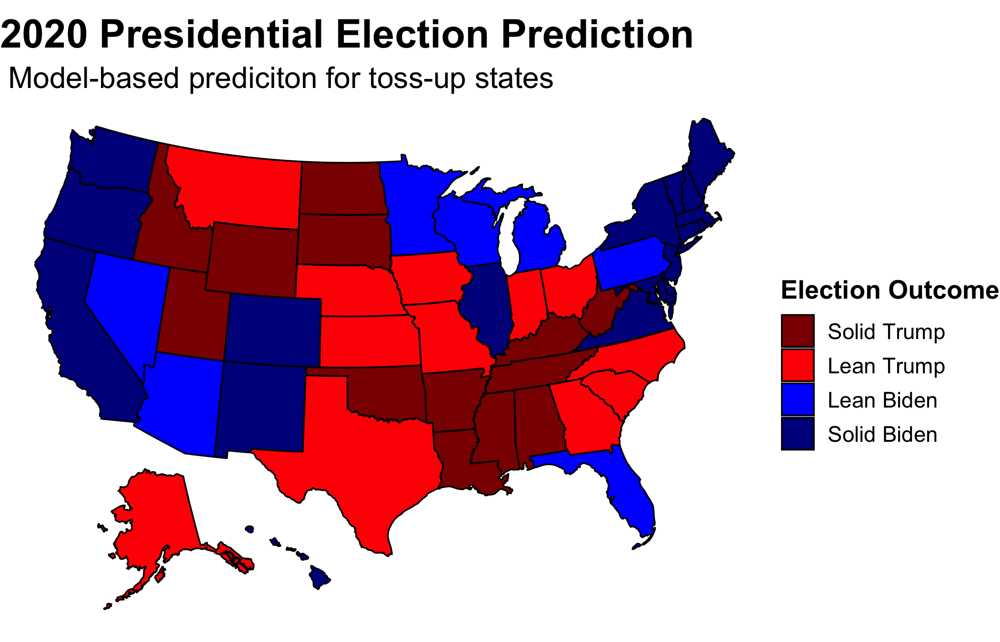
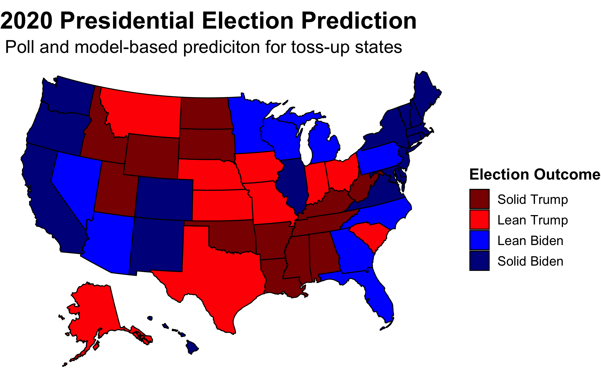
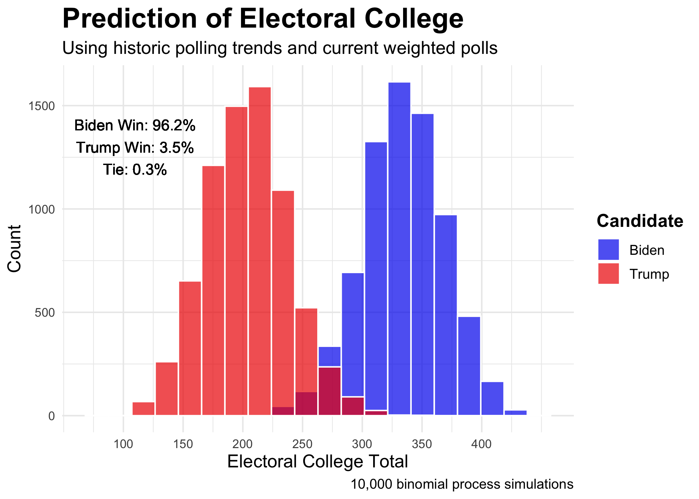
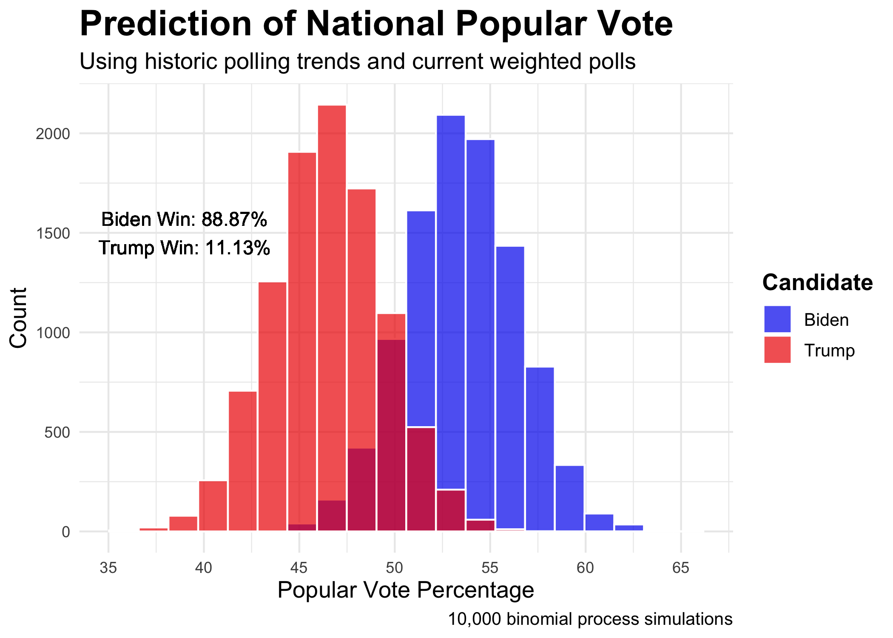

# Final Election Prediction
## November 1, 2020

Just two days ago, FiveThirtyEight's Nate Silver penned the article, ["Trump Can Still Win, But The Polls Would Have To Be Off By Way More Than In 2016"](https://fivethirtyeight.com/features/trump-can-still-win-but-the-polls-would-have-to-be-off-by-way-more-than-in-2016/). My final prediction demonstrates his claim. Only seven states are within five points. Even if Trump won all of them, he would still lose the electoral college. Therefore this election is a battle for the polls. **If Trump wins, my prediction—and predictions of practically the entire industry—will appear even more fraudulent than 2016.**

 

Nevertheless, I still had to set out on this journey. First, I utilized purely weighted polling data to predict state outcomes. Second, I attempted to gain more insight by creating models for the remaining seven toss-up states. Third, I used the models with the best in and out of sample validation to predict their outcomes both with and without the addition of the polling estimates. Fourth, I created probabilistic models for the popular vote and the Electoral College to estimate the uncertainty around my predictions. 

This map displays my poll-based prediction for every state. I did not include fundamentals in my primary prediction for a number of reasons. First, [Nate Silver](https://fivethirtyeight.com/features/how-fivethirtyeights-2020-presidential-forecast-works-and-whats-different-because-of-covid-19/) demonstrates just how volatile of a predictor they can be which was also displayed in [my blog on unemployment](https://samuellowry.github.io/gov1347_blog/posts/02-blog.html)—especially given COVID. Secondly, as noted by [Jennings et al. (2020)](https://www-sciencedirect-com.ezp-prod1.hul.harvard.edu/science/article/pii/S0169207019302572), polls become more predictive the closer to the election they take place which is why at this point in the game [FiveThirtyEight utilizes polls practically exclusively](https://fivethirtyeight.com/features/how-fivethirtyeights-2020-presidential-forecast-works-and-whats-different-because-of-covid-19/).

 

Nevertheless, merely aggregating all polls would not be prudent. As [G. Elliot Morris](https://gelliottmorris.com) informed our class, SurveyMonkey and its peers are not to be trusted. Therefore, I weighted polls both by their [FiveThirtyEight grade](https://projects.fivethirtyeight.com/pollster-ratings/) and by their recency. I weighted all the A polls to have three times the influence as the C polls and weighted the B polls to have twice the amount of influence. I completely cut out the D and F polls with the exception of states which do not have recent reliable polls. In those cases, I unfortunately had to rely largely upon SurveyMonkey. Thankfully, I only needed to use such polls in states where no reputable pollster is paid to conduct polls—i.e., states that we all know which way they are going to go. I also cut out all polls prior to the end of the Democratic Convention—75 from the election. I then weighted polls four weeks out from the election twice as much those between 75 and 28 days out and polls two weeks out from the election three times as much. This left me with seven toss-up states: those where the win margin was within five points. 

With the polls being so close within those seven states, even though [I have frowned upon fundamentals](https://www-sciencedirect-com.ezp-prod1.hul.harvard.edu/science/article/pii/S0169207019302572), I decided that it would be worthwhile to see what they had to say. In total, I constructed 32 linear models and ran the seven states through them. I then evaluated the validity of each model and selected the best one for each state utilizing both in-sample and out-of-sample fit. R-squared measures in-sample fit or how well the model fits the given data. It can be thought of as the proportion of variability in the data captured by the given model. Root-mean-square error or RMSE measures out-of-sample fit or how good a given model is at making predictions based upon outside data. I attained the RMSE by performing leave-one-out cross-validation on all of my models which randomly removes an entry from the model, utilizes that entry to make a prediction, and then takes the difference between the actual and the predicted values calculating the error. In selecting a model for each state, the aim was a high R-squared but a low RMSE. I selected the model which had the best ratio between the two. All in all, even the best of my models do not reliably capture the state trends. Most notably, Texas has the smallest R-squared and the largest RMSE—not a good combo.

Even though I included more complex models with interaction, the simpler ones emerged victorious. The models utilized variations of party, incumbency, incumbent party, election-year third quarter GDP growth, election-year unemployment, and election-year poll averages to predict popular vote share. Florida and Arizona settled on a multivariate model which uses election-year poll averages, party, incumbency, and incumbent party. The model that worked best for Georgia includes incumbent party and election-year unemployment. The best one for North Carolina, Iowa, and Texas also uses election-year unemployment but incumbency instead of incumbent party. Notably, Ohio's merely relies on election-year poll averages. Clearly missing is GDP growth entirely. The coefficients for party, incumbency, and incumbent party can be interpreted as the increase/decrease in popular vote associated with being a Republican, incumbent, or a member of the incumbent party. The coefficients for average poll and unemployment rate can be interpreted as the increase/decrease in popular vote associated with a one percentage point increase in either. When interpreting coefficients of multivariate models, they must be contextualized as the given association controlling for the other predictors.

Subbing in the the model-based predictions for the polls for toss-up states, Iowa, Ohio, Georgia, North Carolina and Texas go for Trump while Arizona and Florida go for Biden.

Utilizing an ensemble evenly split between the models and polls, Georgia and North Carolina become blue. With this equal weighting between the two, which is equivalent to [what FiveThirtyEight does almost 250 days out from the election](https://fivethirtyeight.com/features/how-fivethirtyeights-2020-presidential-forecast-works-and-whats-different-because-of-covid-19/), the map mirrors that which is solely reliant on polls. **Therefore, I predict that Biden will win the Electoral College 350 to 188.**

The question still remains as to the uncertainty around the prediction. For that, I employed probabilistic simulations based upon binomial logistic regression. To further explain the process used to attain this figure, I first created the two models, one for each party, using binomial logistic regression predicting the probability of voting for the given party by using poll averages. Then, I created two distributions, one for each party, by repeatedly drawing voters from the voting eligible population based upon the predictions using the aforementioned models. The attain the necessary variability, I utilized a normal distribution created by using the point estimate and the standard deviation of the polls. By running this process on every state 10 thousand times over and assigning electoral votes to the winner of each simulation, a distribution of possible Electoral College outcomes emerges. The win percentages come from the percent of simulations which have Biden or Trump gaining 270 votes respectively. **While 96.2 percent is a compelling number, the 3.5 percent figure cannot be overlooked. Trump could still win the election.** 

My national popular vote prediction utilizes the same process as my electoral college prediction but instead relies on national polling numbers. Here, Biden wins 88.87 percent of the simulations. **Again, the other 11.13 percent should not be ignored.**

  

By all of my models, Biden is slated to win on Tuesday. If he does not, we should become even more wary of the validity of polls. This go around is a test to see if there really have been improvements in the industry since 2016. If not, Nate Silver will have to actually reconsider his model. Nevertheless, no matter how tumultuous the process it takes to finally declare a victor, **I expect Biden to come out on top.**

*The polling data were sourced from FiveThirtyEight and can be found [here](#https://data.fivethirtyeight.com). All other data was sourced from the course's Canvas page. The code to replicate the above graphics can be found [here](https://github.com/SamuelLowry/gov1347_blog/blob/master/scripts/04-blog.R).*