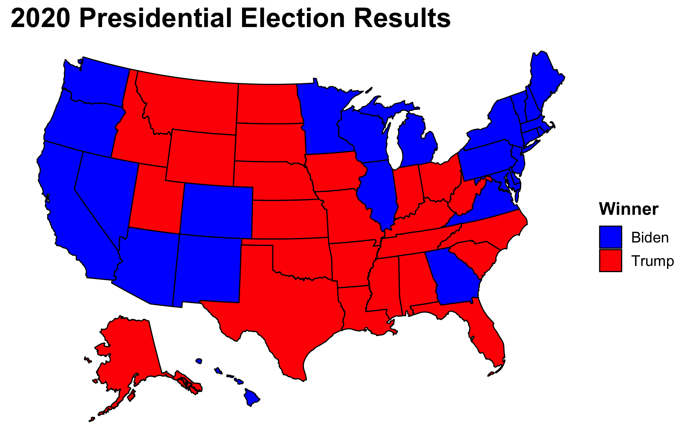
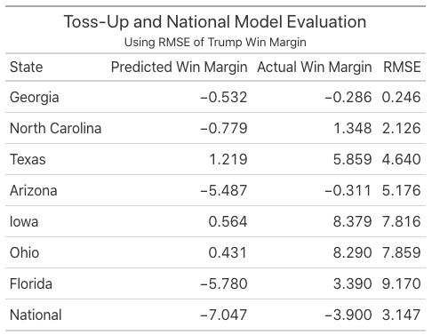
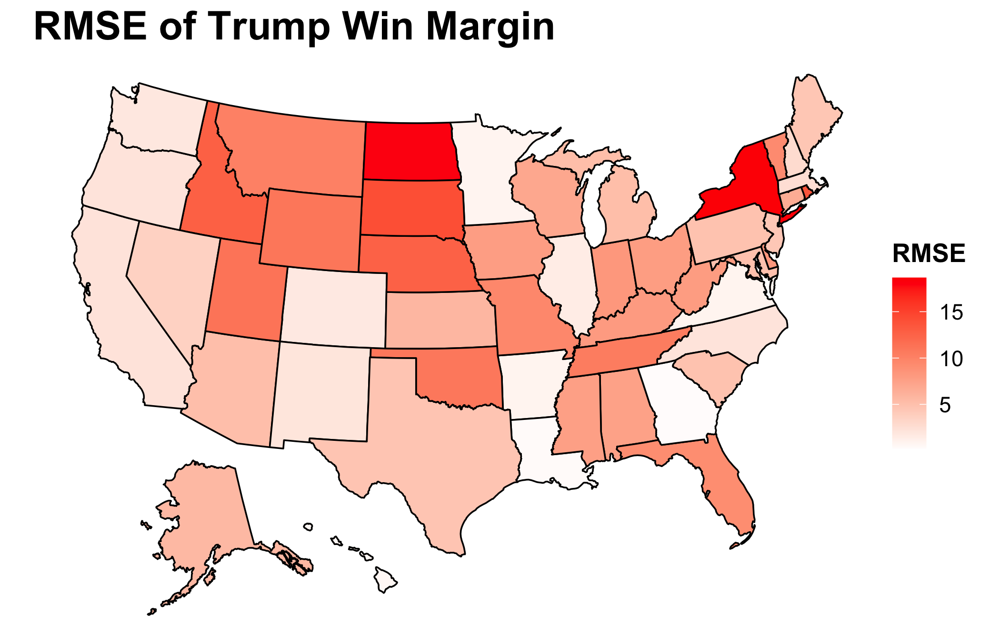
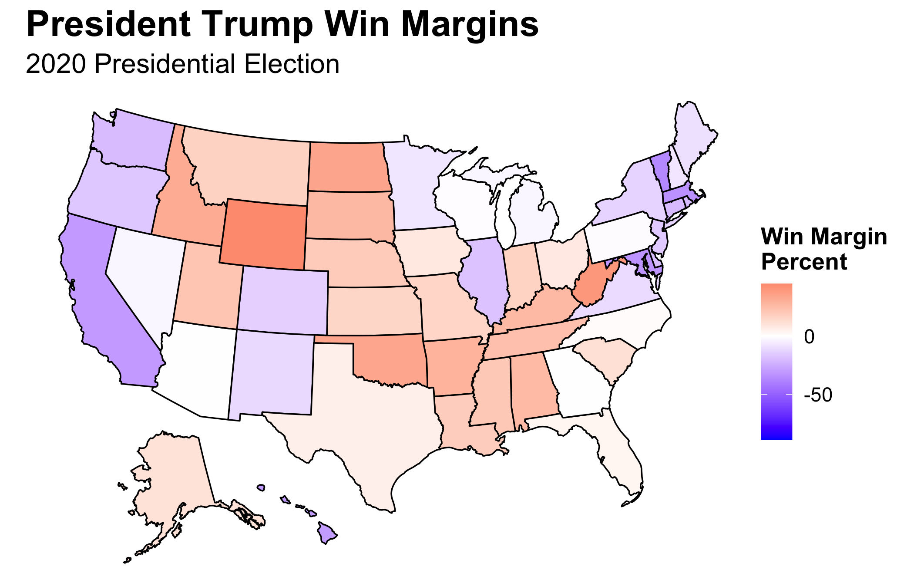

# Post Election Analysis
## November 22, 2020

A description of the accuracy of the model(s), including any apparent patterns in the accuracy.  Graphics should be used here.

Proposed hypotheses for why the model(s) were inaccurate in the estimates or locations where it was inaccurate.  These reasons should not simply be statements of about the quality of the components of the model, e.g., “the polls were not good” or “economic growth was not a good predictor” but should instead be grounded hypotheses on why components of the model may not have been predictive or may not have been predictive in certain cases.

Proposed quantitative tests that could test these hypotheses, e.g., what data, if available, could allow you to test whether the reason proposed really did cause the inaccuracy in your model.  If there is no plausible test of the hypothesis, explain why.  You do not need to perform these tests or explain them in great detail (e.g., there is no need to write down an equation showing your exact test), just propose them.  

At the beginning of my election prediction, I deemed this year the battle of the polls. As Nate Silver wrote right before the election, ["Trump Can Still Win, But The Polls Would Have To Be Off By Way More Than In 2016."](https://fivethirtyeight.com/features/trump-can-still-win-but-the-polls-would-have-to-be-off-by-way-more-than-in-2016/) The polls were still off resulting in surprise Trump victories in Florida and North Carolina as well as nail-biting, close races in Wisconsin and Georgia. Nevertheless, they were not off enough to grant Trump victory.

Here is a recap of my models and predictions. First, I utilized purely weighted polling data to predict state outcomes. Second, I attempted to gain more insight by creating models for the remaining seven toss-up states that were within five points. Third, I used the models with the best in and out of sample validation to predict their outcomes both with and without the addition of the polling estimates. Fourth, I created probabilistic models for the popular vote and the Electoral College to estimate the uncertainty around my predictions.

As to what changes I would make with my model, I should have been more creative and followed in the path of my classmate, [Brendan Chapuis](https://bchaps1999.github.io/2020_election_analytics/posts/final_prediction.html). His model was the most accurate of all of ours—only getting Georgia wrong. What distinguishes his model from many others is the use of prediction markets. As we have read and discussed, both polls and fundamentals have their flaws especially in a year like 2020 with a candidate like Trump. Therefore, instead of trying to correct for those errors, it could be wise to look to a new fount of wisdom. Betting markets force individuals to put their money where their month is which [some have suggested leads to more accuracy](https://www.forbes.com/sites/jimrossi/2020/10/29/election-odds-is-political-betting-more-accurate-than-polling/?sh=73facb3969f8). In addition, I blindly assumed linearity for my variables while Brendan was able to easily show the cubic relationship between betting market prices and vote share and included such within his model. In the future, I would change my model by including betting markets and reassessing linearity. 

Even though I included more complex models with interaction, the simpler ones emerged victorious. The models utilized variations of party, incumbency, incumbent party, election-year third-quarter GDP growth, election-year unemployment, and election-year poll averages to predict popular vote share.

Subbing in the new model-based predictions for the polls for toss-up states, Iowa, Ohio, Georgia, North Carolina, and Texas go for Trump while Arizona and Florida go for Biden.

Utilizing an ensemble evenly split between the models and polls, Georgia and North Carolina become blue. Even with this equal weighting between the two, which is equivalent to [what FiveThirtyEight does almost 250 days out from the election](https://fivethirtyeight.com/features/how-fivethirtyeights-2020-presidential-forecast-works-and-whats-different-because-of-covid-19/), the map mirrors that which is solely reliant on polls. **Therefore, I predict that Biden will win the Electoral College 350 to 188.**

By all of my models, Biden is slated to win on Tuesday. If he does not, we should become even warier of the validity of polls. This go-around is a test to see if there really have been improvements in the industry since 2016. If not, Nate Silver will have to actually reconsider his model. Nevertheless, no matter how tumultuous the process it takes to finally declare a victor, **I expect Biden to come out on top.**

*The polling data were sourced from FiveThirtyEight and can be found [here](#https://data.fivethirtyeight.com). All other data was sourced from the course's Canvas page. The code to replicate the above graphics can be found [here](https://github.com/SamuelLowry/gov1347_blog/blob/master/scripts/04-blog.R).*