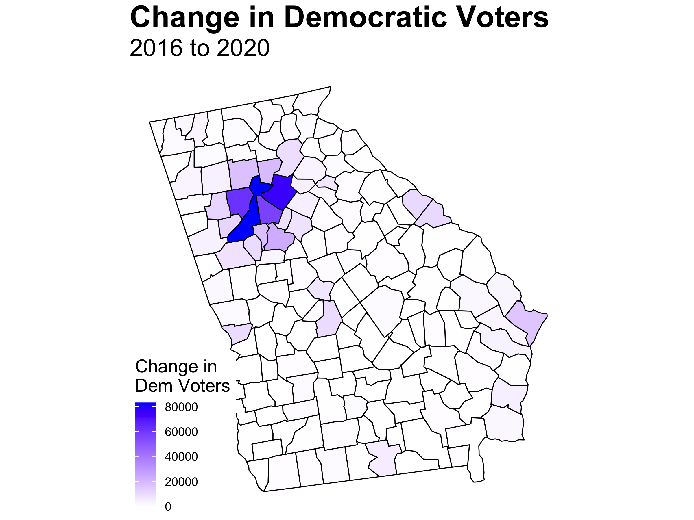

# Urban vs. Suburban
## December 10, 2020

For your blog post, you should:
Summarize the narrative you are choosing to investigate and briefly explain why the narrative might be important to test in the context of the various election-related variables we have discussed this semester.
Describe and justify a testable implication of this narrative. 
Describe the data you collected.
Describe the results of your test and whether it supports the narrative. This should include graphics.  

Remember, you will most likely not be proving or disproving the claim, only offering initial evidence and the language of your post should be appropriately cautious.  

This may be longer than a typical blog post.  

## What counties became more blue?

## Where did the new votes come from?

## What counties pulled their weight?

At the beginning of my election prediction, I deemed this year the battle of the polls. As Nate Silver wrote right before the election, ["Trump Can Still Win, But The Polls Would Have To Be Off By Way More Than In 2016."](https://fivethirtyeight.com/features/trump-can-still-win-but-the-polls-would-have-to-be-off-by-way-more-than-in-2016/) The polls were still off resulting in surprise Trump victories in Florida and North Carolina as well as nail-biting, close races in Wisconsin and Georgia. Nevertheless, they were not off enough to grant Trump victory.

Here is a recap of my models and predictions. First, I utilized purely weighted polling data to predict state outcomes. Second, I attempted to gain more insight by creating models for the remaining seven toss-up states that were within five points. The models utilized variations of party, incumbency, incumbent party, election-year third-quarter GDP growth, election-year unemployment, and election-year poll averages to predict popular vote share. Third, I used the models with the best in and out of sample validation to predict their outcomes both with and without the addition of the polling estimates. Even though I included more complex models with interaction, the simpler ones emerged victorious. Lastly, I created probabilistic models for the popular vote and the Electoral College to estimate the uncertainty around my predictions.

My final prediction utilized an ensemble evenly split between the models and polls. Even with equal weighting between the two, which is equivalent to [what FiveThirtyEight does almost 250 days out from the election](https://fivethirtyeight.com/features/how-fivethirtyeights-2020-presidential-forecast-works-and-whats-different-because-of-covid-19/), the map mirrors that which was solely reliant on polls. I predicted that Biden would win the Electoral College 350 to 188.

With a final Electoral College vote tally of 306 to 232, I ended up getting two states wrong: Florida and North Carolina. Even though I only predicted two states incorrectly, their size swayed the Electoral College tally by 44 votes. If, for example, I had incorrectly predicted a different set of toss-up states such as Arizona and Iowa, I would have only been off by 17 votes. Therefore, I highlight the two incorrect states rather than the 44 vote swing.  

Interestingly, when looking solely at my models, I correctly predicted North Carolina but incorrectly predicted Georgia. With Florida staying blue, I again got two states wrong but this time with a 45 vote swing due to Georgia having 16 electoral votes as compared to North Carolina's 15. 

Funny enough, the two states that flip-flopped depending on if the prediction was poll or model-based had the lowest RMSEs for their respective model out of the toss-up states. Georgia was especially close—being only a quarter of a point off. On the other hand, Florida, the state I consistently predicted incorrectly, had the largest RMSE. My model for Florida already incorporates polling data, and as pundits have pointed out—[polls were unable to properly capture the Cuban vote in Miami](https://www.politico.com/news/2020/11/04/biden-miami-cubans-election-2020-433999). As one of my housemates jokes, "The Miami Cubans are the new white non-college-educated Midwesterners." *Pollsters will promise that they are the final frontier of proper weighting for the next four years.*

I have thus far been unable to determine why some of my models were better at predicting the election outcome as compared to others. North Carolina and Georgia did not include polling within their models and have relatively low RMSEs. Nevertheless, Iowa and Texas also did not utilize polling and have much larger RMSEs. A similar trend of claim and counterexample also extends to the in and out of sample validation used in the model selection process as well as the use or lack thereof of other predictive variables. Lastly, **similar to the polls which overestimated Biden's electoral votes, all of my models also underestimated Trump's win margin**.

From working with the polling data and from discussion in class, the theory that non-toss-up states are more likely to have larger RMSEs has emerged. It makes sense, for those states are less likely to have polls conducted, and those that are conducted tend to be less reliable ([see my discussion of the use of SurveyMonkey from my prediction](https://samuellowry.github.io/gov1347_blog/posts/08-blog.html)). We can see this is being the case, for much of Middle America's support for Trump was underestimated. Nevertheless, counterexamples again exist. Arkansas and Louisiana are solid red states, yet their RMSEs are quite small.  

In regard to toss-up states where lots of *reliable* polling occurs, a wide range of RMSEs are seen. Florida was close. Nevertheless, it has one of the largest RMSEs. At the same time, Georgia was extremely close and had a minuscule RMSE. One choice I made based upon Biden's large lead at the time in the polls was to not create additional models for the Rust Belt states. Wisconsin, Michigan, and Pennsylvania all flipped blue as expected, but their RMSEs are also astronomical. It is clear that the post-2016 secret sauce has not fully solved all of the polling issues regarding white non-college-educated Midwesterners. One aside that should be noted is that [New York has yet to count all of the votes which could change the RMSE](https://www.nbcnews.com/politics/2020-elections/new-york-results).

**The polls yet again consistently underestimated President Trump.** Only DC and Vermont overestimated his vote share. Even though Biden won as predicted, there should still be a come to Jesus moment for pollsters. A landslide was predicted, yet Biden's victory came down to half a point in a handful of states. *There is a joke that the best election prediction is two points more Republican than whatever Nate Silver's happens to be, and this yet again seems to hold true.*

As to what changes I would make with my model, I should have been more creative and followed in the path of my classmate, [Brendan Chapuis](https://bchaps1999.github.io/2020_election_analytics/posts/final_prediction.html). His model was the most accurate of all of ours—only getting Georgia wrong. What distinguishes his model from many others is the use of prediction markets. As we have read and discussed, both polls and fundamentals have their flaws especially in a year like 2020 with a candidate like Trump. Therefore, instead of trying to correct for those errors, it could be wise to look to a new fount of wisdom. Betting markets force individuals to put their money where their mouth is which [some have suggested leads to more accuracy](https://www.forbes.com/sites/jimrossi/2020/10/29/election-odds-is-political-betting-more-accurate-than-polling/?sh=73facb3969f8). In addition, I blindly assumed linearity for my variables while Brendan was able to easily show the cubic relationship between betting market prices and vote share and included such within his model. In the future, I would change my model by including betting markets and reassessing linearity. 

Much of my criticism of my own prediction has come down to the polls consistently underestimating Trump's vote share. There are two dominant theories as to why that is: non-response bias and improper weighting. Testing the first hypothesis is quite straightforward. Many polls seek voters that are formally registered with a party. Therefore, testing this hypothesis is as simple as observing the difference in the non-response rate between registered Democrats and registered Republicans. The second issue is a little more difficult to parse out. Trump's surprise victory in 2016 is often attributed to not accounting for the boost in white non-college-educated Midwestern turn-out. This occurs in part due to pollsters focusing on likely voter polls where the goal is to discover how people are going to vote and not who is going to vote. Therefore, additional polls could be run solely for the purpose of better capturing the demographic breakdown of likely voters. Then, this breakdown could be used in lieu of historical trends. The comparison between the new breakdown and the historical one would provide evidence for or against the improper weighting hypothesis. Another option is to compare the weights used by pollsters to the actual demographics of those that have voted. Nevertheless, I acknowledge that these are simplistic answers to the profoundly complex issues facing pollsters, but they are a starting point of investigation.

*The 2016 data is from the MIT Election Data + Science Lab and can be found [here](https://dataverse.harvard.edu/file.xhtml?persistentId=doi:10.7910/DVN/VOQCHQ/HEIJCQ&version=6.0). The 2020 data is from Raphael Fontes' page on kaggle and can be found [here](https://www.kaggle.com/unanimad/us-election-2020?select=president_county_candidate.csv). The county coding data is from the CDC and can be found [here](https://www.cdc.gov/nchs/data_access/urban_rural.htm). The code to replicate the above graphics can be found [here](https://github.com/SamuelLowry/gov1347_blog/blob/master/scripts/10-blog.R).*